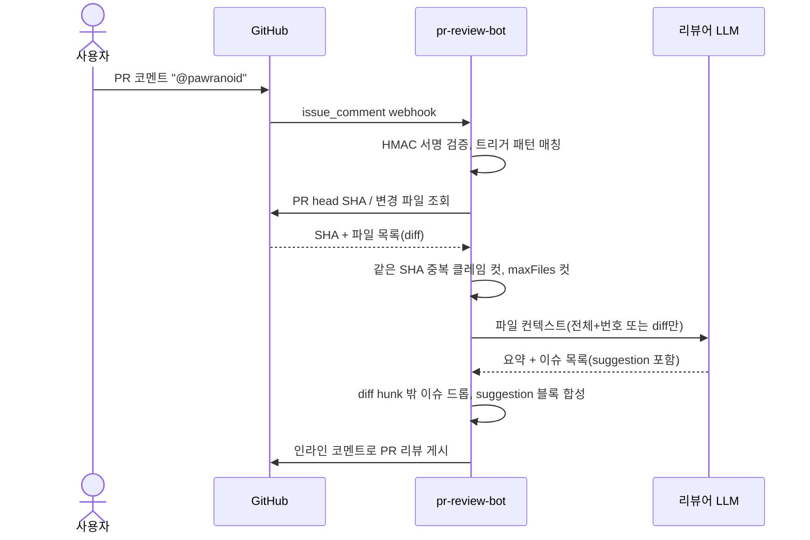
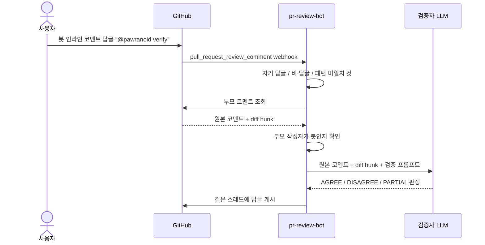

# pr-review-bot

GitHub PR을 자동 리뷰하고, 그 리뷰를 다른 LLM으로 다시 검증하는 Spring Boot 기반 GitHub App.

## 목차

1. [개요](#개요)
2. [동작 흐름](#동작-흐름)
3. [트리거 명령어](#트리거-명령어)
4. [아키텍처](#아키텍처)
5. [요구 사항](#요구-사항)
6. [환경 변수](#환경-변수)
7. [GitHub App 설정](#github-app-설정)
8. [로컬 실행](#로컬-실행)
9. [배포](#배포)
10. [핵심 설계 결정](#핵심-설계-결정)
11. [프롬프트](#프롬프트)
12. [테스트](#테스트)
13. [트러블슈팅](#트러블슈팅)
14. [라이선스](#라이선스)

## 개요

단일 LLM에 코드 리뷰를 맡기면 자기 출력을 옹호하거나 없는 이슈를 만들어내기 쉬워, 리뷰와 검증을 서로 다른 모델로 분리한 봇이다.

PR 코멘트에 `@pawranoid` 를 남기면 봇이 변경된 파일을 모아 **리뷰어 LLM** 에게 리뷰를 요청하고, 결과를 PR 인라인 코멘트로 게시한다. 수정안이 있는 경우 GitHub의 "Apply suggestion" 으로 곧바로 반영할 수 있도록 ` ```suggestion ` 블록까지 함께 붙인다.

봇이 단 인라인 코멘트 답글에 `@pawranoid verify` 를 남기면, **검증자 LLM** 이 해당 코멘트가 실제 이슈인지 오탐인지 교차 검증해 답글로 회신한다. 자기 옹호 편향을 줄이기 위해 리뷰어 LLM과 검증자 LLM은 의도적으로 서로 다른 모델을 사용한다.

신뢰성을 위해 두 가지 안전장치를 둔다. 첫째, 리뷰어 LLM이 지목한 라인이 실제 diff hunk 안에 존재할 때만 인라인 코멘트로 변환해 환각을 차단한다. 둘째, 같은 PR의 같은 commit SHA에 대해서는 중복 리뷰를 게시하지 않는다.

## 동작 흐름

### 리뷰 흐름 (`@pawranoid`)



### 검증 흐름 (`@pawranoid verify`)



## 트리거 명령어

| 명령 | 위치 | 동작 |
|---|---|---|
| `@pawranoid` | PR 일반 코멘트 | PR 전체 리뷰 |
| `@pawranoid verify` | 봇 인라인 코멘트 답글 | 해당 코멘트 교차 검증 |

대소문자는 구분하지 않는다. 검증은 부모가 **봇이 단 인라인 코멘트** 일 때만 동작하며, 그 외 답글이나 일반 PR 코멘트에서는 무시된다. 또한 일반 PR 코멘트에 `@pawranoid verify` 라고 적어도 리뷰가 돌지 않는다 — verify 패턴이 잡히면 리뷰 트리거에서 명시적으로 제외한다.
