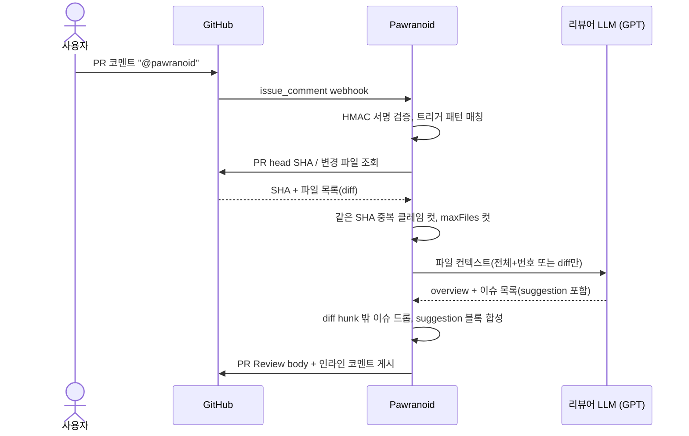

# Pawranoid

> 단일 LLM 편향을 막기 위해 리뷰와 검증을 다른 모델로 분리한 GitHub PR 리뷰 봇

GPT가 PR을 리뷰하면 Claude가 그 리뷰의 정당성을 다시 판단한다. 자기 옹호 편향과 환각을 줄이기 위해 두 LLM을 의도적으로 분리했다. Spring Boot + Kotlin 기반 GitHub App으로 구현.

      

<br>

- **이중 LLM 교차 검증으로 자기 옹호 편향 차단**: 리뷰는 OpenAI(`gpt-5.4`), 검증은 Anthropic(`claude-sonnet-4-6`). 같은 모델이 자기 출력을 옹호하는 편향 회피
- **환각 차단 결정적 룰 + payload 사전 검증**: LLM이 지목한 라인이 실제 diff hunk 안에 없으면 인라인 게시 보류, 다중 라인은 startLine..line 전체 연속성 검증해 GitHub API 422 차단까지 사전 필터링
- **Race-free 동시성 제어 (`ConcurrentHashMap.compute` atomic 클레임)**: 같은 commit SHA 동시 트리거에도 정확히 1회만 실행. check-then-act 안티패턴 회피
- **Hexagonal Port + 단일 JSON Schema로 두 LLM 벤더 통합**: OpenAI strict mode 와 Anthropic tool_use 가 같은 schema 본문 재사용 — 벤더 추가 시 통합 코드 중복 0


<!-- TODO: Hero 바로 아래에 PR Review 출력 코멘트 전체 캡처 1장 (Pawranoid PR overview 섹션) -->

## Quick Start

### 사용

PR 일반 코멘트에 `@pawranoid` 만 남기면 봇이 변경된 파일을 모아 리뷰를 시작한다.

```
@pawranoid
```

봇이 단 인라인 코멘트의 답글에 `@pawranoid verify` 를 남기면, 다른 모델이 그 코멘트의 정당성을 교차 검증해 답글로 회신한다.

```
@pawranoid verify
```

> 트리거는 멘션 두 가지뿐이다. 슬래시 커맨드(`/review`, `/verify`)는 폐기됐다.

<!-- TODO: 인라인 코멘트 + suggestion 블록 캡처 (Apply suggestion 버튼 보이는 한 장) -->

### 출력

리뷰가 끝나면 PR Review body 한 곳에 **PR 개요 + 변경 사항 글머리 + 검토 통계 + 파일별 요약(접힘) + 머지 평가 blockquote** 가 한 코멘트로 묶여 게시된다. 인라인 코멘트는 별개로 라인에 박힌다.

### 로컬 실행

```bash
./gradlew bootRun
```

webhook 으로 GitHub 이벤트를 받아야 하므로 ngrok 같은 터널이 필요하다. 환경 변수는 `.env` 에 OpenAI/Anthropic API key, GitHub App ID/Installation ID/Private Key path, webhook secret 을 설정한다.

## 동작 흐름



검증 흐름(`@pawranoid verify`) 은 봇이 단 인라인 코멘트의 답글로 트리거된다. 부모 코멘트와 주변 코드 ±20줄을 검증자 LLM(Claude)에 전달하고, free-form 한국어 답글을 같은 스레드에 게시한다.

<!-- TODO: @pawranoid verify 답글 캡처 (cross-LLM verify 동작 시각화) -->

## 엔지니어링 결정

### 인증·보안 — JWT App auth, HMAC SHA-256, timing-safe 비교

- **GitHub App + Installation Access Token 캐싱**: PAT 대신 GitHub App을 사용해 organization-scoped 권한과 감사 추적 확보. JWT로 ITT를 발급받아 만료 60초 전까지 in-memory 캐시 — [`GitHubAuthService.kt`](src/main/kotlin/com/pawranoid/infrastructure/github/GitHubAuthService.kt)
- **HMAC SHA-256 + timing-safe 비교**: webhook 서명 검증은 `MessageDigest.isEqual` 로 timing attack 방어. 일반 `String.equals` 가 아니라 length-leak/early-return 없는 상수 시간 비교 — [`WebhookSignatureVerifier.kt`](src/main/kotlin/com/pawranoid/presentation/WebhookSignatureVerifier.kt)

### 동시성 — atomic compute, @Async, in-flight 클레임

- **`ConcurrentHashMap.compute` 단일 원자 클레임**: 같은 PR + 같은 SHA 에 동시 트리거가 와도 정확히 한 명만 클레임 성공. check-then-act 패턴(`if !contains then put`)은 race condition 이 있어 대신 `compute` 안 lambda 가 entire entry update 를 atomic 으로 보장 — [`ReviewHistoryService.kt`](src/main/kotlin/com/pawranoid/domain/service/ReviewHistoryService.kt)
- **`@Async` + try/finally 클레임 해제**: webhook은 즉시 200 으로 GitHub에 응답하고 LLM 호출은 background. `verifyReviewComment` 는 try/finally 로 in-flight set 에서 자기 키를 해제해 사후 재시도 가능 — [`VerifyHistoryService.kt`](src/main/kotlin/com/pawranoid/domain/service/VerifyHistoryService.kt)

### 외부 API 통합 — Hexagonal Port, 단일 schema 양 벤더 공유

- **`LlmPort` 인터페이스 + 다중 구현**: `@Primary` 로 `GptClient` 를 메인 리뷰 LLM 으로, `@Qualifier("claudeClient")` 로 `ClaudeClient` 를 verifier 에 강제 주입. LLM 추가/교체 시 application 코드 변경 없음 — [`LlmPort.kt`](src/main/kotlin/com/pawranoid/domain/port/LlmPort.kt)
- **단일 JSON Schema 양 벤더 재사용**: OpenAI Structured Outputs (`response_format: json_schema`, strict) 와 Anthropic Tool Use (`tool input_schema`) 가 같은 schema 본문을 사용. 각 클라이언트는 wrapping 만 다르게 적용 — [`ReviewSchema.kt`](src/main/kotlin/com/pawranoid/infrastructure/llm/ReviewSchema.kt)

### 도메인 파이프라인 — 검증·페이징·escape 가드레일

- **diff hunk 라인 검증**: LLM 이 지목한 `line` 이 patch hunk 의 실제 라인에 존재할 때만 인라인 코멘트로 변환. 다중 라인은 `startLine..line` 범위 **전체**가 hunk 안에 있어야 통과 (GitHub API 가 중간 비는 범위는 422 거부) — [`ReviewService.isIssueInDiff`](src/main/kotlin/com/pawranoid/domain/service/ReviewService.kt)
- **결정적 PR 평가**: 머지 가능 여부, 사이즈, 테스트 동반, 제목/설명/커밋 메시지 품질을 LLM 없이 결정적 룰로 평가해 PR overview 안 blockquote 로 노출. 토큰 0, 재현 가능 — [`PrEvaluator.kt`](src/main/kotlin/com/pawranoid/domain/service/support/PrEvaluator.kt)
- **suggestion 블록 fence escape**: 사용자가 클릭 한 번으로 적용 가능한 ` ```suggestion ` 블록 합성. 제안 본문에 backtick run 이 들어 있으면 동적으로 fence 길이를 늘려 충돌 회피 — [`CommentBuilder.kt`](src/main/kotlin/com/pawranoid/domain/service/support/CommentBuilder.kt)
- **페이징 안전 cap**: `/pulls/{n}/files` 는 한 페이지 100개 제한. 최대 10페이지(1000 파일) 까지 받고 cap 도달 시 silent truncation 방지를 위해 경고 로깅 — [`GitHubClient.fetchFiles`](src/main/kotlin/com/pawranoid/infrastructure/github/GitHubClient.kt)

## 테스트 전략

JUnit 5 + AssertJ 단위 테스트 96개 통과. 외부 의존성(LLM/GitHub)은 격리하고 순수 로직만 검증.

| 영역 | 테스트 | 검증 포인트 |
|---|---|---|
| 트리거 파싱 | `CommandDetectorTest` | `@pawranoid` 멘션, false positive(`@pawranoid-staging`, email 패턴), 검증 vs 리뷰 분리 |
| 동시성 | `ReviewHistoryServiceTest` / `VerifyHistoryServiceTest` | atomic 클레임, 동일 SHA 중복 차단, release 후 재시도 |
| webhook 보안 | `WebhookSignatureVerifierTest` | HMAC 정상 서명/위조/길이 조작/누락 |
| diff 처리 | `DiffAnnotatorTest` / `PathMatcherTest` | hunk 라인 추출, 다중 라인 범위 연속성, 경로 매칭 |
| 출력 빌더 | `PrOverviewBuilderTest` / `CommentBuilderTest` | markdown 구조, suggestion fence escape, 평가 blockquote 분리 |
| PR 평가 | `PrEvaluatorTest` | 머지 상태 분기, 사이즈 임계, 테스트 커버리지 검출, 제목/설명/커밋 품질 |

LLM 호출은 `LlmPort` 인터페이스로 추상화돼 있어 단위 테스트는 모킹 없이 도메인 로직만 검증할 수 있다. 통합 테스트(실제 OpenAI/Anthropic 호출)는 별도로 분리.

## 왜 이렇게 만들었나

### 1. 왜 두 LLM을 분리했나?

단일 LLM에 리뷰를 맡기면 다음 두 문제가 발생한다.

- **자기 출력 옹호 편향**: 같은 모델에 "이 리뷰가 정당한가?" 라고 물으면 자기가 한 말을 옹호하는 경향이 있다. 사실상 cross-check 가 동작하지 않는다.
- **환각 reinforcement**: LLM 이 없는 이슈를 만들어내도 같은 모델은 그것을 그대로 "있다" 고 확언한다.

다른 모델로 분리하면 이 두 편향이 깨진다. 리뷰는 OpenAI 가 하고 검증은 Anthropic 이 하면, 검증자 입장에선 외부 의견이라 비판적으로 볼 수 있다. 비용/지연은 사용자가 명시적으로 `@pawranoid verify` 를 호출할 때만 발생하므로 메인 흐름엔 부담이 없다.

### 2. 왜 환각 차단을 LLM이 아니라 결정적 룰로 했나?

LLM 의 "이 라인이 진짜 있나" 자기 검증은 같은 환각을 반복할 위험이 있다. 대신 봇이 받은 patch 의 hunk 정보로 결정적으로 검증한다.

```
LLM 이 지목한 line 번호 → patch hunk 의 라인 집합에 포함? → 포함되면 게시, 아니면 드롭
```

다중 라인 제안은 더 까다롭다. `startLine..line` 범위의 **모든 라인** 이 hunk 안에 있어야 한다. GitHub API 가 중간 비는 다중 라인 코멘트를 422 로 거부하기 때문에, LLM 이 startLine 과 line 만 hunk 안이고 중간이 비어 있는 경우를 무시하면 422 가 터진다. 이건 봇이 자기 자신 PR 을 리뷰하다 발견한 케이스로, [`ReviewService.isIssueInDiff`](src/main/kotlin/com/pawranoid/domain/service/ReviewService.kt) 에서 범위 전체 멤버십을 검증한다.

### 3. 왜 atomic compute 인가? (check-then-act 가 아닌 이유)

처음 구현은 직관적인 패턴이었다.

```kotlin
// ❌ race condition
if (!history.isAlreadyReviewed(repo, number, sha)) {
    history.markReviewed(repo, number, sha)
    runReview(...)
}
```

문제는 `isAlreadyReviewed` → `markReviewed` 사이에 다른 스레드가 끼어들 수 있다는 것. 같은 SHA 에 두 webhook 이 거의 동시에 도착하면 두 스레드 모두 `false` 를 받고 양쪽 다 리뷰를 실행한다.

`ConcurrentHashMap.compute` 는 entry 업데이트 람다 전체를 atomic 으로 보장한다. 두 스레드가 동시에 호출해도 정확히 한 명만 `claimed = true` 를 받는다.

```kotlin
fun tryClaim(repo, number, sha): Boolean {
    var claimed = false
    state.compute(key(repo, number)) { _, current ->
        if (current == sha) current
        else { claimed = true; sha }
    }
    return claimed
}
```

이 패턴은 봇 자기 PR 리뷰 중에 잡힌 race condition 을 고친 결과로, 비슷한 케이스가 webhook 멱등성 처리에서도 재사용된다.

## 한계와 다음 단계

### 한계

- **환각 100% 차단은 불가능**: 라인 번호 수준의 환각은 결정적으로 막지만, "이 코드는 IOException 을 던집니다" 같은 **본문 내용** 의 환각은 LLM 컨텍스트 한계라 cross-verify 단계에서 잡아야 한다. 라인 검증 + 다른 모델 검증 두 layer 모두 통과한 false positive 는 여전히 가능.
- **메타 루프 리뷰의 본질적 한계**: 봇이 자기 자신 PR 을 리뷰할 때, 봇이 만든 결정 trade-off 를 LLM 은 "위험" 으로 분류하기 쉽다. 사용자가 의도적으로 받아들인 결정인지 LLM 은 모른다.
- **인메모리 history**: `ReviewHistoryService` / `VerifyHistoryService` 가 봇 재시작 시 초기화. 학습 단계엔 충분하나 운영 단계엔 Redis/DB 백업 필요.

### 다음 단계

- **Incremental Push Review**: `pull_request.synchronize` 이벤트로 push 마다 자동 리뷰. 직전 SHA → 신규 SHA diff 만 LLM 에 전달해 토큰 절감.
- **Auto-resolve threads on fix**: 봇 인라인 코멘트 라인이 후속 push 로 변경되면 GraphQL 로 thread 자동 resolve.
- **`.pawranoid.yml` 레포별 설정**: ignore 패턴, severity threshold, prompt variant 같은 동작 customization.
